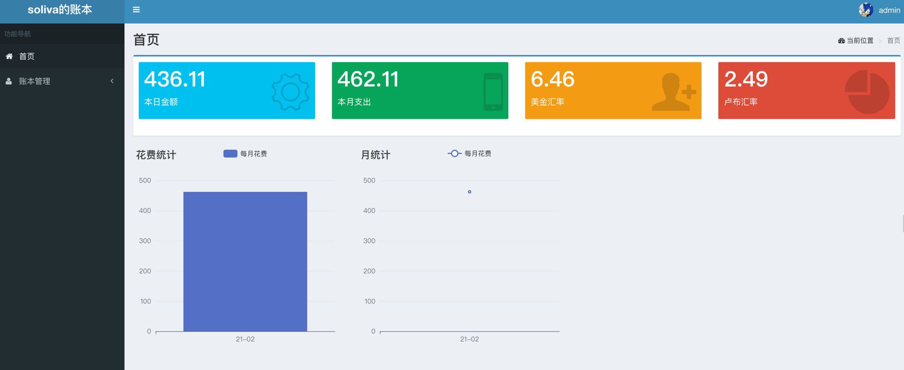
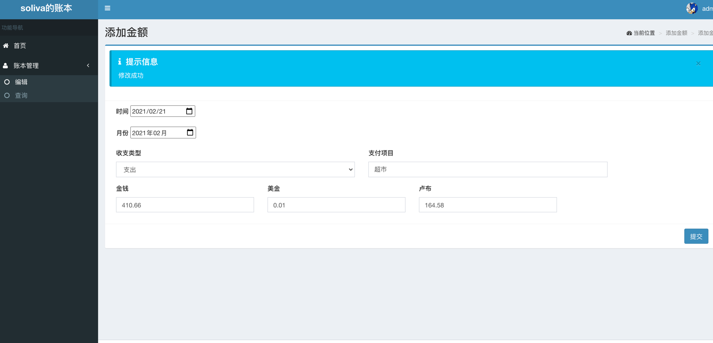
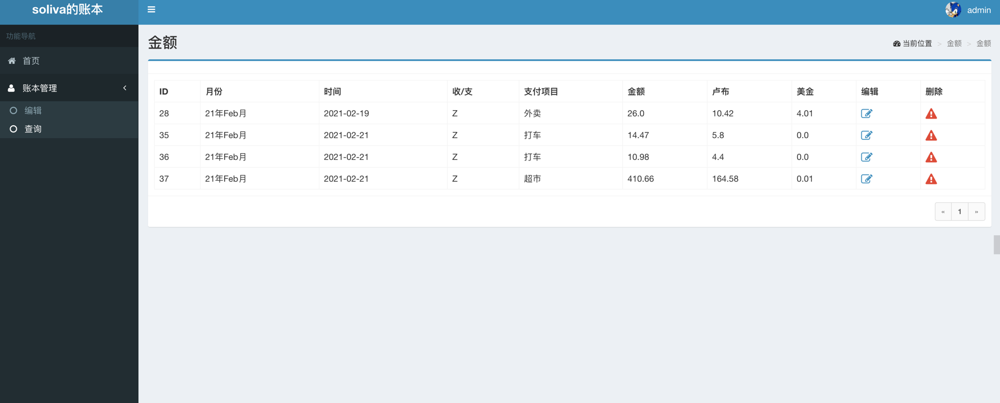

# Account

使用flask 结合peewee 调度数据库 写的一个记账程序

```shell
conda create -p <dir of path>/account python=3
conda activate env_path
```
```shell
pip install -r requirements.txt
```

首页统计

输入页面

数据库查询页面


#系统参数配置
```shell
系统参数配置
编辑config.py， 修改SECRET_KEY及MySQL数据库相关参数
SECRET_KEY = os.environ.get('SECRET_KEY') or 'your-secret'
DB_HOST = '127.0.0.1'
DB_USER = 'foobar'
DB_PASSWD = 'foobar'
DB_DATABASE = 'foobar'

```
```shell
数据库初始化
自动建表 直接运行python3 models.py

插入管理员用户（默认admin/admin)

INSERT INTO `user` (`id`, `username`, `password`, `fullname`, `email`, `phone`, `status`)
VALUES
	(1, 'admin', 'pbkdf2:sha1:1000$Km1vdx3W$9aa07d3b79ab88aae53e45d26d0d4d4e097a6cd3', '管理员', 'admi
```
```shell
编辑log-app.conf，修改日志路径
args=('/path/to/log/flask-rest-sample.log','a','utf8')
```

